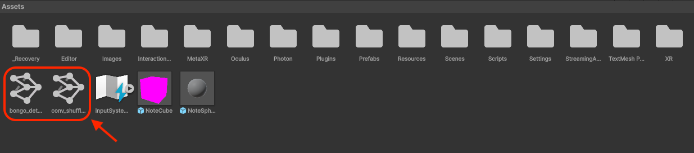
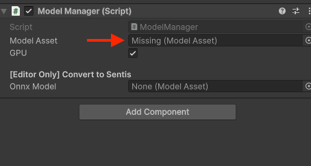
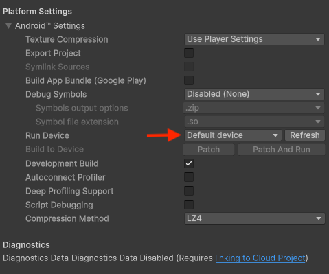
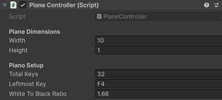
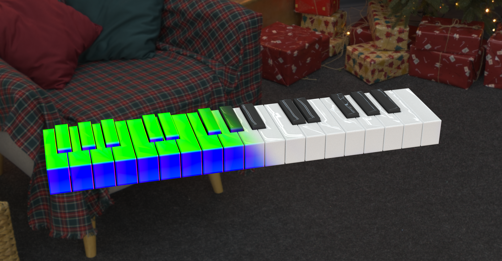
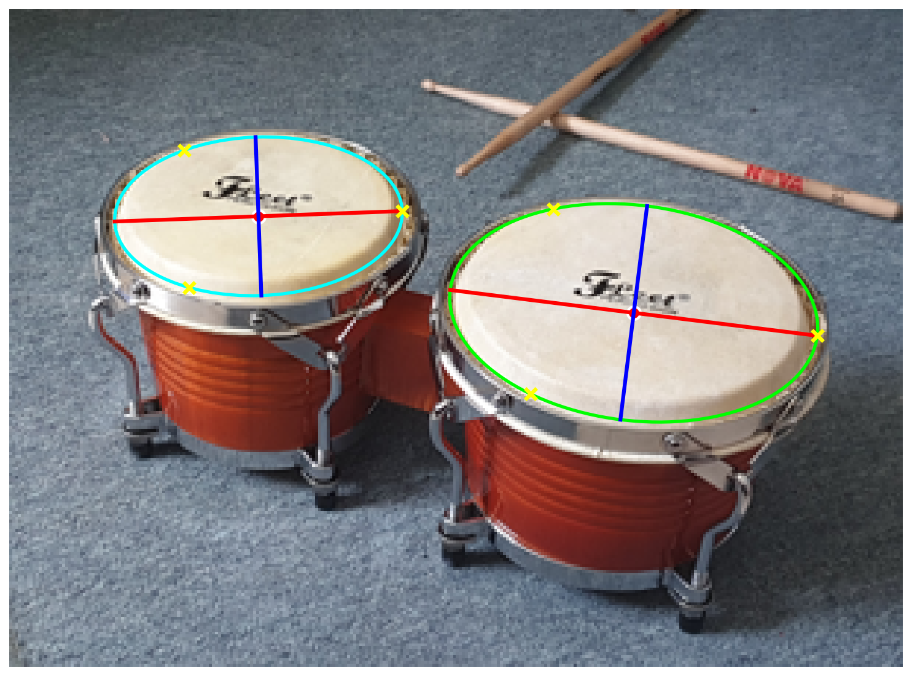

<h1 align="center">AR-Musician<br><sub><sup>Playing Instruments the Futuristic Way</sup></sub></h1>

<div align="center">

[](https://huggingface.co/datasets/gserifi/SynthesiaSet)&#160;
[](https://polybox.ethz.ch/index.php/s/RXfAobWzkpjRgzG)&#160;
[](assets/report.pdf)&#160;
[](assets/poster.pdf)
</div>

<div align="center">
Matan Davidi*
&nbsp;&nbsp;&nbsp;&nbsp;
Cyril Moser*
&nbsp;&nbsp;&nbsp;&nbsp;
Gent Serifi*
&nbsp;&nbsp;&nbsp;&nbsp;
Nicola Studer*
&nbsp;&nbsp;&nbsp;&nbsp;
Ata Celen
&nbsp;&nbsp;&nbsp;&nbsp;

ETH Zürich, Switzerland
&nbsp;&nbsp;&nbsp;&nbsp;
\*Equal contribution
</div>

Below are instructions to setup and run the [Unity App](#unity-app), as well as the [Synthetic Dataset + Perception Pipelines](#synthetic-dataset--perception-pipelines).
This project was done as part of the [Mixed Reality](https://cvg.ethz.ch/lectures/Mixed-Reality/) course at ETH Zürich.

# Table of Contents

- [Unity App](#unity-app)
  - [Requirements](#requirements)
  - [Setup](#setup)
  - [Configuring your own Piano](#configuring-your-own-piano)
- [Synthetic Dataset + Perception Pipelines](#synthetic-dataset--perception-pipelines)
  - [Request Access to Gated Models](#request-access-to-gated-models)
  - [Installation](#installation-1)
  - [Synthetic Dataset](#synthetic-dataset)
    - [Preparation](#preparation)
    - [Generating Samples](#generating-samples)
    - [Pre-Rendered Dataset](#pre-rendered-dataset)
  - [Piano Perception](#piano-perception)
    - [Training](#training)
    - [ONNX Export](#onnx-export)
  - [Bongo Perception](#bongo-perception)
    - [Preprocessing](#preprocessing)
    - [Testing the Detector](#testing-the-detector)
    - [ONNX Export](#onnx-export-1)
- [Citation](#citation)
- [References](#references)

# Unity App

## Requirements
- Unity Version `6000.2.8f1`
- Developer Mode on Quest 3 enabled (https://developers.meta.com/horizon/documentation/native/android/mobile-device-setup/)
- A piano or bongo drums (important)

## Setup
1. Clone the repository:
   ```bash
   git clone git@github.com:MixedRealityETHZ/AR_Musician.git
   ```
2. Open project in Unity `6000.2.8f1`
3. Download the ONNX models from [Polybox](https://polybox.ethz.ch/index.php/s/RXfAobWzkpjRgzG) and put them in the scene tree.
   <div align="center" style="padding: 10px 0 10px 0">
   
   </div>
4. Drag the `.onnx` files into their respective slot: `MainScene > Logic > Detection > {Piano,Bongo} > CV > SentisInterface > Model Asset`
   <div align="center" style="padding: 10px 0 10px 0">
   
   </div>
5. Connect your Quest 3 via USB
6. Enable USB Debugging (If not prompted, see: https://developers.meta.com/horizon/documentation/unity/unity-development-overview/)
7. Go to `File > Build Profiles` and choose your Meta Quest
   <div align="center" style="padding: 10px 0 10px 0">
   
   </div>
8. You can now build the app using `Ctrl + B`, or by clicking directly on `Build and Run` (you might need to first select the `Meta Quest` platform and hit `Switch Platform`).

## Configuring your own Piano
Depending on your piano model, you might need to adjust the piano parameters in the `PlaneController`.

1. Open `MainScene > Logic > Detection > PlaneController`
2. Adjust `Total Keys` and `Leftmost Key` to your piano. (Optionally also `White To Black Ratio`)

<div align="center">

</div>

# Synthetic Dataset + Perception Pipelines

## Request Access to Gated Models

`DINOv3` and `SAM3` are *gated models* that require you to request access before usage.
Please follow the instructions at the respective links: [DINOv3](https://huggingface.co/facebook/dinov3-vits16-pretrain-lvd1689m), [SAM3](https://huggingface.co/facebook/sam3).
In case you haven't already, you also need to create a Hugging Face account and sign in locally using `hf auth login` (for details, visit the [docs](https://huggingface.co/docs/huggingface_hub/en/quick-start#authentication)).

## Installation

```bash
cd SynthesiaSet
python3 -m venv venv
source venv/bin/activate
pip install torch torchvision lightning
pip install -e .
```

This will automatically install all required dependencies. For the remainder of this guide, we assume that you are inside the
`./SynthesiaSet` directory.

## Synthetic Dataset

<div align="center">

</div>

### Preparation

Before you can start rendering samples, you need to download the environment maps from [Polybox](https://polybox.ethz.ch/index.php/s/RXfAobWzkpjRgzG)
and extract the `envmaps.zip` to match this layout: `./envmaps/*.exr`. We thank [PolyHaven](https://polyhaven.com/hdris) for providing these assets under
a `CC0` license.

### Generating Samples

Sampling images from our synthetic data pipeline is as simple as:

```bash
synthesia gen --n-samples <n>
```

A complete list of options can be found by running `synthesia gen -h`. The most important one is `--scene.camera.quality-preset`,
it controls the output resolution. By default, it is set to `ViT` (304x224), which should be used for training the perception module.
However, it also supports `low` (640x480), `medium` (1920x1440), and `high` (3840x2880). It is also possible to directly specify
the resolution via the `--scene.camera.width` and `--scene.camera.height` arguments.

By default, the generated samples are stored in `./outputs/`, and they can be visualized using:

```bash
synthesia vis --idx <i>
```

### Pre-Rendered Dataset

We provide 100k pre-rendered samples with ground-truth keypoint annotations on [Hugging Face](https://huggingface.co/datasets/gserifi/SynthesiaSet).
You can also find an overview of the data layout at that link. The section below explains how to use them for training the perception modules.

## Piano Perception

### Training

To train the piano perception module, simply run:

```bash
piano-perception <model_architecture>
# Example: piano-perception conv_shuffle_vits16
# Full list of architectures: piano-perception -h
# Additional options: piano-perception <model_architecture> -h
```

By default, the training script will stream the dataset from Hugging Face. Note that this won't use any disk space as the data is fetched
on the fly. However, in case of a slow internet connection, it may be beneficial to download the dataset locally (`~8.3GB`). This can be
configured by passing the `--no-stream-data` flag to the training script. Alternatively, if you decide to train on your own samples, you
can pass the `--data-dir <path_to_outputs>` argument.

The training script writes logs and checkpoints to `./piano_outputs/<model_architecture>/`. You can monitor training progress using
TensorBoard:

```bash
tensorboard --logdir ./piano_outputs/
```

### ONNX Export

```bash
piano-export --ckpt <path_to_checkpoint>
# Example: piano-export --ckpt ./piano_outputs/conv_shuffle_vits16/checkpoints/ckpt_000.pth
```

This will save the model in ONNX format under `./piano_exports/<model_architecture>_240x320_merged.onnx`.

## Bongo Perception

### Preprocessing

To instantiate the bongo perception module, you first need to segment and embed the reference image `./bongo_assets/reference.jpg`.
Note that this will download `SAM3`, `DINOv3`, and `AnyUp` on the first run.

```bash
bongo-preprocess
```

The segmentation and features are saved to `./bongo_outputs/`.

### Testing the Detector

We provide a simple test script that runs the bongo detector on a sample image `./bongo_assets/test.jpg`:

```bash
bongo-detect --imB ./bongo_assets/test.jpg --ptA ./bongo_outputs/reference.pt
```

The visualization is saved to `./bongo_outputs/ellipses.png` and should look like this:

<div align="center">

</div>

### ONNX Export

To export the detector for deployment, simply run:

```bash
bongo-export --imB ./bongo_assets/test.jpg --ptA ./bongo_outputs/reference.pt
```

The model in ONNX format is saved under `./bongo_exports/bongo_detector_224x304_384d_bilinear_kpts_merged.onnx`.

# Citation

If you find this project useful for your research or application, please cite:

```bibtex
@software{ARMusician,
    title = {AR-Musician: Playing Instruments the Futuristic Way},
    author = {Davidi, Matan and Moser, Cyril and Serifi, Gent and Studer, Nicola and Celen, Ata},
    year = 2026
}
```

# References

```bibtex
@software{jakob2022mitsuba3,
    title = {Mitsuba 3 renderer},
    author = {Wenzel Jakob and Sébastien Speierer and Nicolas Roussel and Merlin Nimier-David and Delio Vicini and Tizian Zeltner and Baptiste Nicolet and Miguel Crespo and Vincent Leroy and Ziyi Zhang},
    note = {https://mitsuba-renderer.org},
    version = {3.0.1},
    year = 2022,
}
```

```bibtex
@misc{simeoni2025dinov3,
  title={{DINOv3}},
  author={Sim{\'e}oni, Oriane and Vo, Huy V. and Seitzer, Maximilian and Baldassarre, Federico and Oquab, Maxime and Jose, Cijo and Khalidov, Vasil and Szafraniec, Marc and Yi, Seungeun and Ramamonjisoa, Micha{\"e}l and Massa, Francisco and Haziza, Daniel and Wehrstedt, Luca and Wang, Jianyuan and Darcet, Timoth{\'e}e and Moutakanni, Th{\'e}o and Sentana, Leonel and Roberts, Claire and Vedaldi, Andrea and Tolan, Jamie and Brandt, John and Couprie, Camille and Mairal, Julien and J{\'e}gou, Herv{\'e} and Labatut, Patrick and Bojanowski, Piotr},
  year={2025},
  eprint={2508.10104},
  archivePrefix={arXiv},
  primaryClass={cs.CV},
  url={https://arxiv.org/abs/2508.10104},
}
```

```bibtex
@misc{carion2025sam3segmentconcepts,
      title={SAM 3: Segment Anything with Concepts},
      author={Nicolas Carion and Laura Gustafson and Yuan-Ting Hu and Shoubhik Debnath and Ronghang Hu and Didac Suris and Chaitanya Ryali and Kalyan Vasudev Alwala and Haitham Khedr and Andrew Huang and Jie Lei and Tengyu Ma and Baishan Guo and Arpit Kalla and Markus Marks and Joseph Greer and Meng Wang and Peize Sun and Roman Rädle and Triantafyllos Afouras and Effrosyni Mavroudi and Katherine Xu and Tsung-Han Wu and Yu Zhou and Liliane Momeni and Rishi Hazra and Shuangrui Ding and Sagar Vaze and Francois Porcher and Feng Li and Siyuan Li and Aishwarya Kamath and Ho Kei Cheng and Piotr Dollár and Nikhila Ravi and Kate Saenko and Pengchuan Zhang and Christoph Feichtenhofer},
      year={2025},
      eprint={2511.16719},
      archivePrefix={arXiv},
      primaryClass={cs.CV},
      url={https://arxiv.org/abs/2511.16719},
}
```

```bibtex
@article{wimmer2025anyup,
    title={AnyUp: Universal Feature Upsampling},
    author={Wimmer, Thomas and Truong, Prune and Rakotosaona, Marie-Julie and Oechsle, Michael and Tombari, Federico and Schiele, Bernt and Lenssen, Jan Eric},
    journal={arXiv preprint arXiv:2510.12764},
    year={2025}
}
```
